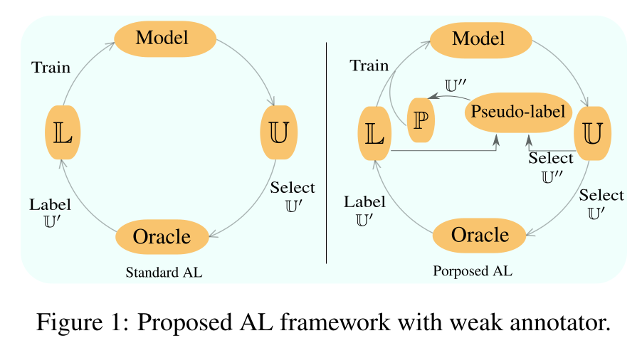
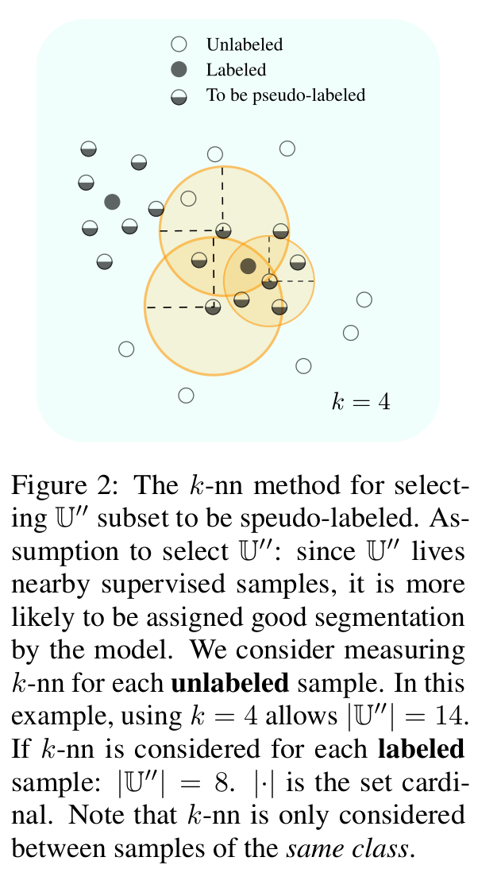
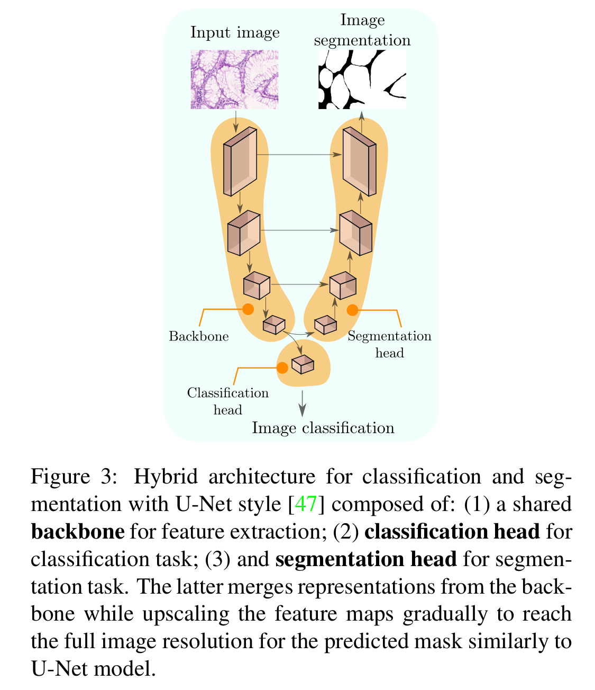
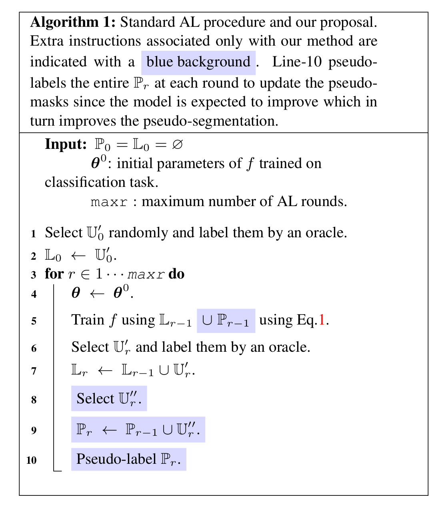
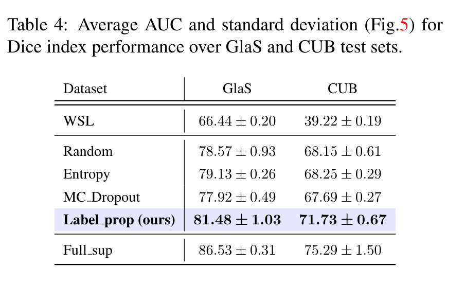
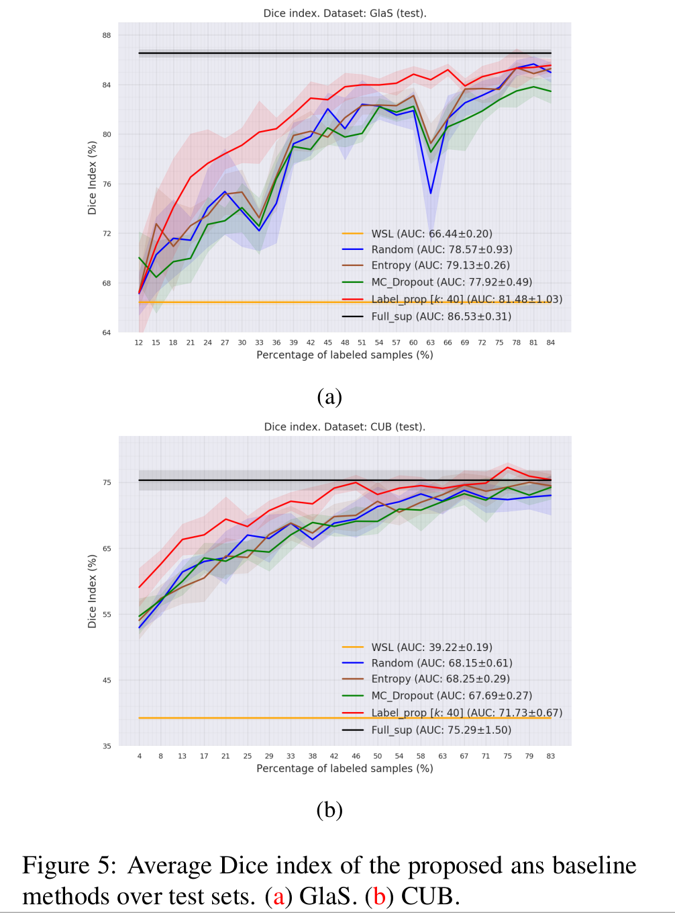
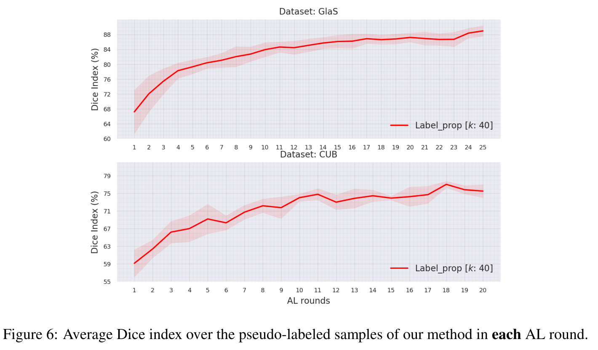

### Pytorch 1.4.0 code for:
`Deep Active Learning for Joint Classification & Segmentation with Weak Annotator`
### Citation:
```
@article{belharbi2020deep_al_join_cl_seg_weak_ann,
  title={Deep Active Learning for Joint Classification & Segmentation with Weak Annotator},
  author={Belharbi, S. and Ben Ayed, I. and McCaffrey, L. and Granger, E.},
  journal={CoRR},
  volume={abs/2010.04889},
  year={2020}
}
```

### Issues:
Please create a github issue.

### Content:
* [Method highlights](#method)
* [Datasets](#datasets)
* [Requirements](#requirements)
* [How to run the code step-by-step](#runCode)
* [Reproducibility](#reproducibility)


#### <a name="method"></a> Method highlights:
* Method:


* Knn:


* Architecture:


* Algorithm:


* Perfromance:




* Pseudo-labeling performance:


#### <a name="datasets"></a> Download datasets:

* GlaS: [./download-glas-dataset.sh](cmds/download-glas-dataset.sh).
* Caltech-UCSD Birds-200-2011:  [./download-caltech-ucsd-birds-200-2011-dataset.sh](cmds/download-caltech-ucsd-birds-200-2011-dataset.sh)

You find the splits in [./folds](./folds). The code that generated the splits is [./create_folds.py](./create_folds.py).


#### <a name="requirements"></a> Requirements:
We use [Pytorch 1.4.0](https://pytorch.org/) and
[Python 3.7.6](https://www.python.org). For installation, see [
./dependencies](./dependencies) for a way on how to install the requirements within a virtual environment.


#### <a name="runCode"></a> How to run the code step-by-step:
1. Generate the CSV files using:
    ```bash
    python create_folds.py
    ```
2. Generate yaml files:
    ```bash
    python yaml-gen.py
    ```  
    This will generate a yaml file per dataset. Each yaml provides only the
 backbone of the hyper-parmeters. We will update them in the next step
  according to each dataset/active learning method.
3. Generate the bash files to run the active learning experiments.
    ```bash
    python gen_configs.py
    ```
    This will generate all the experiments for all active learning methods for
    all the datasets (GLAS, CUB).
    For instance, if you want to run the method `MC_Dropout` over `GLAS` dataset
    on the gpu `0`, use:
    ```bash
    ./run-glas-MC_Dropout.sh 0
    ```
    The file `run-glas-MC-Dropout.sh` contains all the experiments for this
    method/datasets. It is something like this:
    ```bash
    #!/usr/bin/env bash

    # ==============================================================================
    cudaid=$1

    #  Start MYSEED: 0


    time python main.py --yaml glas.yaml --MYSEED 0 --optn0__name_optimizer sgd \
    --batch_size 20 --valid_batch_size 1 --optn0__lr 0.1 --optn0__weight_decay \
    0.0001 --optn0__momentum 0.9 --max_epochs 1000 --optn0__name_lr_scheduler \
    mystep --optn0__lr_scheduler True --optn0__step_size 100 --optn0__gamma 0.9 \
    --optn0__min_lr 1e-07 --optn0__t_max 50 --optn0__beta1 0.9 --optn0__beta2 \
    0.999 --optn0__eps_adam 1e-08 --optn0__amsgrad False --name_model \
    hybrid_model --backbone resnet18 --backbone_dropout 0.0 --path_pre_trained \
    ./pretrained/resnet18-glas.pt --pre_trained True --alpha 0.6 --kmax 0.1 \
    --kmin 0.1 --dropout 0.1 --dropoutnetssl 0.5 --modalities 5 --crop_size 416 \
    --ratio_scale_patch 0.9 --up_scale_small_dim_to 432 --padding_ratio 0.01 \
    --pad_eval True --cudaid $cudaid  --dataset glas --p_init_samples \
    11.940298507462687 --p_samples 2.985074626865672 --max_al_its 25 --task \
    SEGMENTATION --split 0 --fold 0  --subtask Classification_Segmentation \
    --nbr_bins_histc 256 --min_histc 0.0 --max_histc 1.0 --sigma_histc 100000.0 \
    --resize_h_to_opt_mask 128 --resize_mask_opt_mask True --smooth_img True \
    --smooth_img_ksz 3 --smooth_img_sigma 0.9 --enhance_color True \
    --enhance_color_fact 3.0  --backbone_dropout 0.2 --mcdropout_t 50 \
    --debug_subfolder paper_label_prop/glas/MC_Dropout  --knn 40 \
    --freeze_classifier True --segloss_l BinCrossEntropySegmLoss --segloss_pl \
    BinCrossEntropySegmLoss --scale_cl 1.0 --scale_seg 1.0 --scale_seg_u 0.1 \
    --scale_seg_u_sch ConstantWeight --scale_seg_u_end 1e-09 --scale_seg_u_sigma \
    150.0 --scale_seg_u_p_abstention 0.0 --weight_pseudo_loss False --protect_pl \
    True --estimate_pseg_thres True --estimate_seg_thres True --seg_threshold 0.5 \
    --base_width 24 --leak 64 --seg_elbon False  --loss HybridLoss  --al_type \
    MC_Dropout  --al_it 0 --exp_id 10_03_2020_13_58_33_376747__3089229
    # ==============================================================================


    time python main.py --yaml glas.yaml --MYSEED 0 --optn0__name_optimizer sgd \
    --batch_size 20 --valid_batch_size 1 --optn0__lr 0.1 --optn0__weight_decay \
    0.0001 --optn0__momentum 0.9 --max_epochs 1000 --optn0__name_lr_scheduler \
    mystep --optn0__lr_scheduler True --optn0__step_size 100 --optn0__gamma 0.9 \
    --optn0__min_lr 1e-07 --optn0__t_max 50 --optn0__beta1 0.9 --optn0__beta2 \
    0.999 --optn0__eps_adam 1e-08 --optn0__amsgrad False --name_model \
    hybrid_model --backbone resnet18 --backbone_dropout 0.0 --path_pre_trained \
    ./pretrained/resnet18-glas.pt --pre_trained True --alpha 0.6 --kmax 0.1 \
    --kmin 0.1 --dropout 0.1 --dropoutnetssl 0.5 --modalities 5 --crop_size 416 \
    --ratio_scale_patch 0.9 --up_scale_small_dim_to 432 --padding_ratio 0.01 \
    --pad_eval True --cudaid $cudaid  --dataset glas --p_init_samples \
    11.940298507462687 --p_samples 2.985074626865672 --max_al_its 25 --task \
    SEGMENTATION --split 0 --fold 0  --subtask Classification_Segmentation \
    --nbr_bins_histc 256 --min_histc 0.0 --max_histc 1.0 --sigma_histc 100000.0 \
    --resize_h_to_opt_mask 128 --resize_mask_opt_mask True --smooth_img True \
    --smooth_img_ksz 3 --smooth_img_sigma 0.9 --enhance_color True \
    --enhance_color_fact 3.0  --backbone_dropout 0.2 --mcdropout_t 50 \
    --debug_subfolder paper_label_prop/glas/MC_Dropout  --knn 40 \
    --freeze_classifier True --segloss_l BinCrossEntropySegmLoss --segloss_pl \
    BinCrossEntropySegmLoss --scale_cl 1.0 --scale_seg 1.0 --scale_seg_u 0.1 \
    --scale_seg_u_sch ConstantWeight --scale_seg_u_end 1e-09 --scale_seg_u_sigma \
    150.0 --scale_seg_u_p_abstention 0.0 --weight_pseudo_loss False --protect_pl \
    True --estimate_pseg_thres True --estimate_seg_thres True --seg_threshold 0.5 \
    --base_width 24 --leak 64 --seg_elbon False  --loss HybridLoss  --al_type \
    MC_Dropout  --al_it 1 --exp_id 10_03_2020_13_58_33_376747__3089229
    # ==============================================================================

    ... and so on.
    ```

    See all the keys that you can override using the command line in  
    `parseit .get_yaml_args()`.
    See `constants.py` for the different active learning methods and other
    constants.
4. First, run `WSL` method using seed `0`. Then, store the model's weights in
   `./pretrained/resnet18-glas.pt` for `GLAS` dataset, and
   `./pretrained/resnet18-cub.pt` for `CUB` dataset. The model's weight will
    be stored by the code in the experiment folder as `best_model.pt`. Copy
     and rename that file to the pretrained folder.
    Then, you can proceed training other active learning methods.
    For convenience, we provide the pre-trained models. They are also accessible
     on [google drive](https://drive.google.com/drive/folders/1EcW2NaNsaAiL38R7cHJruq5T60c20goG?usp=sharing).
      If you are unable to access to the google drive folder, you can
      create an issue to find a different way to share the models.
 5. To plot all the curves of ALL methods, you can use,
    ```bash
    python plot_active_learning_curves.py
    ```
    Figures and other files will be stored in the folder `./paper`.
6. All experiments are done on split 0, fold 0 for all datasets.
7. Used seeds: 0, 1, 2, 3, 4.
8. For comparison, test Dice index at each round for each seed per method
/dataset are stored in a pickled file `./paper/results-per-method-each-run
-dataset-{}.pkl` in a dictionary with the key structure (for GlaS example):
    ```python
     In [1]: import pickle as pkl
     In [20]: with open("results-per-method-each-run-dataset-glas.pkl", "rb") as fin:
         ...:     stuff = pkl.load(fin)

     In [22]: stuff.keys()
     Out[22]: dict_keys(['WSL', 'Random', 'Entropy', 'MC_Dropout ', 'Label_prop ', 'Full_sup'])
     In [23]: stuff['Random'].keys()
     Out[23]: dict_keys(['test'])
     In [25]: stuff['Random']['test'].keys()
     Out[25]: dict_keys(['dice_idx'])
     In [30]: type(stuff['Random']['test']['dice_idx'])
     Out[30]: numpy.ndarray
     In [33]: stuff['Random']['test']['dice_idx'].shape
     Out[33]: (5, 25)  # 5 runs order according to the seeds mentioned above.
     # each run has 25 active learning rounds.
     In [34]: stuff['Random']['test']['dice_idx']
     Out[34]:
     array([[64.29491024, 68.26534145, 68.65601286, 73.98197889, 74.09444943,
            76.94103431, 71.02902677, 74.06351458, 72.56103337, 78.99458144,
            79.30639431, 82.01419845, 76.71336837, 84.38693479, 82.37608485,
            82.45970614, 82.74210036, 70.06073229, 80.62327955, 81.25951763,
            83.21664881, 85.40988602, 84.97116379, 85.60305871, 85.8245454 ],
           [68.31420053, 66.07314749, 68.52430042, 68.37349785, 69.61945057,
            72.38897134, 69.81996067, 70.94271801, 72.44806387, 76.77195571,
            77.22773626, 81.96324389, 81.54838331, 82.73607336, 82.25827597,
            80.07024139, 79.83664479, 74.32793241, 83.06158803, 83.11748274,
            83.19173351, 83.69847603, 85.22795111, 85.6280417 , 85.46123117],
           [66.71858971, 74.63980228, 70.05757164, 72.07348552, 76.8091803 ,
            74.19304218, 74.75387901, 71.29095811, 76.03948873, 80.75353745,
            80.39951026, 82.95400567, 78.27928425, 78.79928647, 82.69563619,
            81.45481266, 80.41814812, 72.53054075, 77.89946325, 81.37026601,
            84.9570284 , 82.88242236, 84.4128149 , 86.50917932, 83.91877256],
           [69.44425181, 72.50236176, 74.71349549, 71.88765407, 71.65116169,
            71.98040944, 76.57313634, 70.48917307, 71.09192843, 78.13675031,
            80.39377347, 83.49617004, 82.48789147, 82.3112049 , 80.35638832,
            81.90072447, 82.43326299, 80.88932212, 82.0582027 , 83.96295935,
            81.2384364 , 83.12704161, 86.00610383, 85.92767775, 85.55987038],
           [66.9079571 , 69.86388833, 75.98011885, 70.86716615, 78.10507054,
            81.32279277, 76.64835989, 74.21971507, 79.86538256, 81.44296072,
            81.71520639, 79.7781498 , 83.15113798, 83.77281189, 83.63054134,
            81.77533798, 84.02370453, 78.2903273 , 82.59848274, 82.92209167,
            83.00199233, 83.72783348, 86.06250815, 84.60930221, 84.13211673]])

    ```


#### General notes:
* All the experiments, splits generation were achieved using seed 0.
See [./create_folds.py](./create_folds.py)
* All the results in the paper were obtained using one GPU.

#### Paths:
We hard-coded some paths (to the data location). For anonymization reasons, we
replaced them with fictive paths.
So, they won't work for you. A warning will be raised with an indication to
the issue. Then, the code exits. It is something like this:
```python
warnings.warn("You are accessing an anonymized part of the code. We are going to exit. Come here and fix this "
                  "according to your setup. Issue: absolute path to Caltech-UCSD-Birds-200-2011 dataset.")
```
or
```python
"Sorry, it seems we are enable to recognize the " \
"host. You seem to be new to this code. " \
"So, we recommend you add your baseurl on your own."
```
